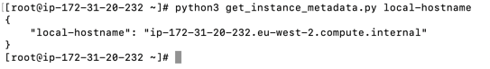

# challenge-2

This script can be executed in EC2 using `python3` to get all metadata applicable to the instance or specific metadata by passing the metadata path to the script.


### Example usage:

```
python3 get_instance_metadata.py
python3 get_instance_metadata.py placement/availability-zone
```




